# System Patterns

## Architecture Overview

Eventy360 follows a modern web application architecture with clear separation of concerns:

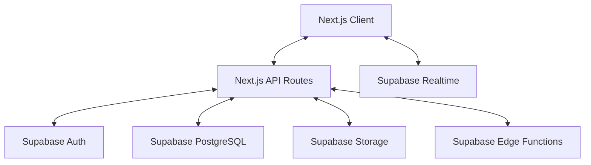

## Core System Components

### User Management System

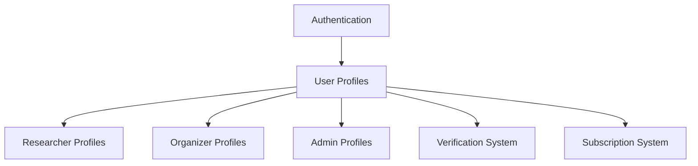

- **Authentication Flow**: Managed by Supabase Auth
- **Profile Creation**: Creates base profile and role-specific profile
- **Verification Process**: Status transitions from submitted → under_review → approved/rejected
- **Profile Types**: Each user type has specialized profile fields and capabilities

### Subscription System

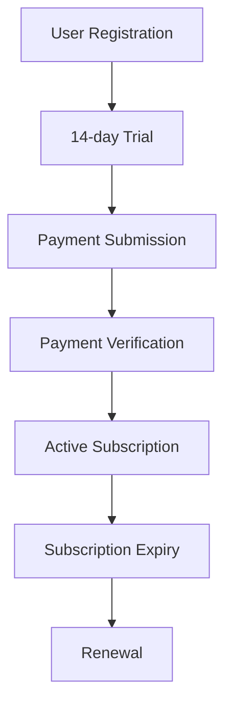

- **Default Subscription**: Free researcher tier assigned automatically
- **Trial Period**: All users get 14-day trial access to paid features
- **Payment Flow**: Submit payment proof → Admin verification → Subscription activation
- **Subscription Tiers**: free_researcher, paid_researcher, paid_organizer
- **Status Flow**: trial → pending → active → expired

### Event Management System

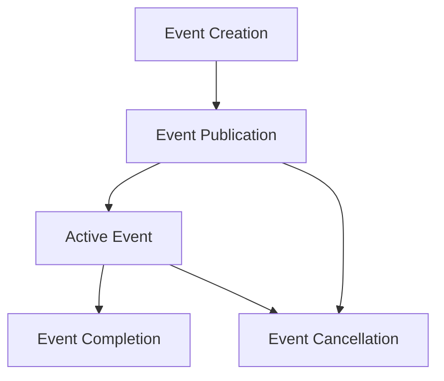

- **Creation Restrictions**: Only verified organizers with active subscriptions
- **Event Limits**: Maximum 5 active events per organizer
- **Status Flow**: published → active → completed (or canceled)
- **Event Topics**: Events are tagged with research topics for discoverability
- **Access Control**: Published events visible to all, management restricted to creators

### Submission System

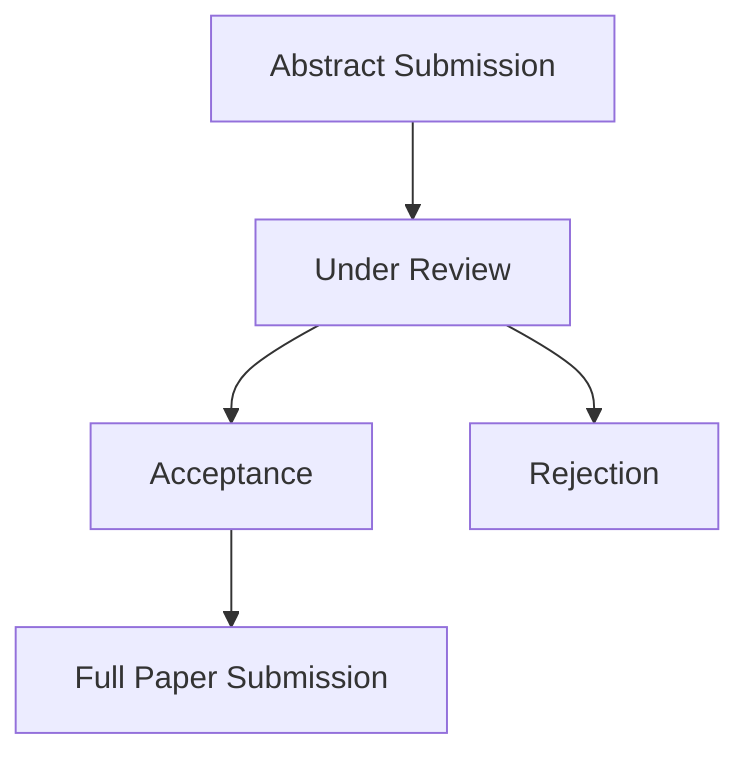

- **Submission Eligibility**: Only paid researchers can submit papers
- **File Types**: Support for abstract and full paper files
- **Status Flow**: received → under_review → accepted/rejected
- **Review Process**: Organizers review submissions and provide feedback
- **Notification System**: Status changes trigger email notifications

### Verification System

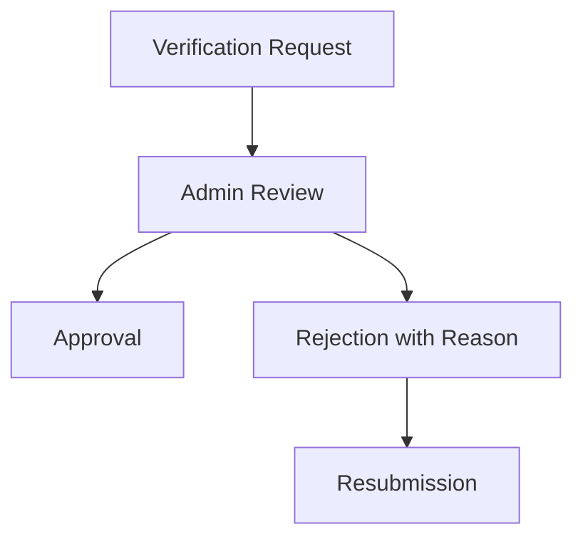

- **Verification Types**: Separate flows for researchers and organizers
- **Document Requirements**: Institutional email and proof document required
- **Admin Review**: Specialized interface for administrators to review requests
- **Badge System**: Verified users receive visual indicator on profiles

### Notification System

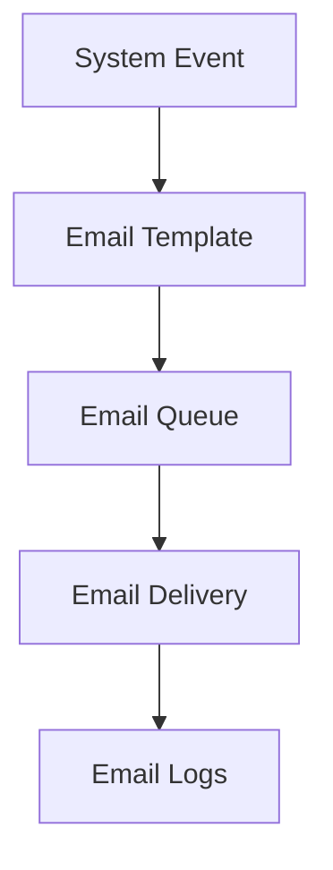

- **Email-Based**: Primary notification method is email
- **Template-Based**: Pre-defined templates with variable substitution
- **Queuing System**: Reliable delivery with retry mechanism
- **Logging**: Comprehensive tracking of all notification attempts
- **Trigger Events**: User registration, verification status changes, payment status changes, submission reviews

## Data Flows

### User Registration Flow

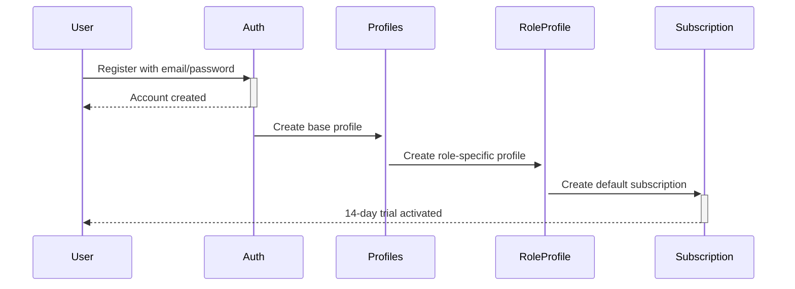

### Event Creation Flow

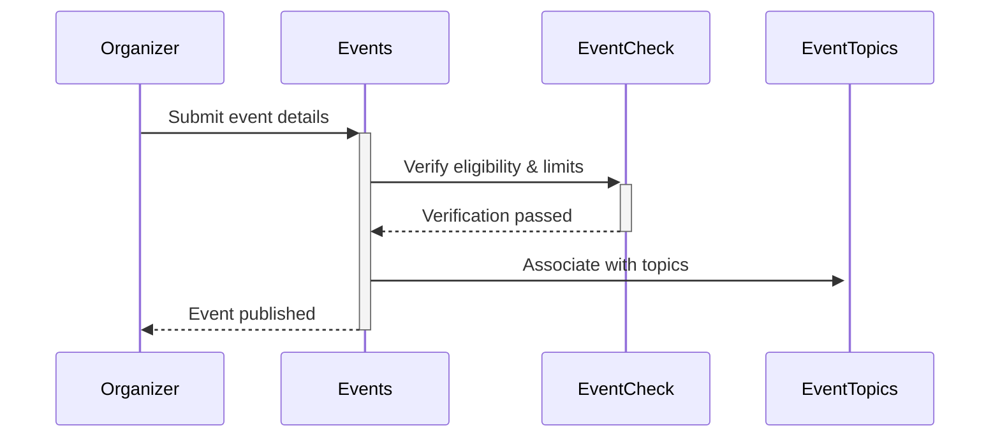

### Submission Flow

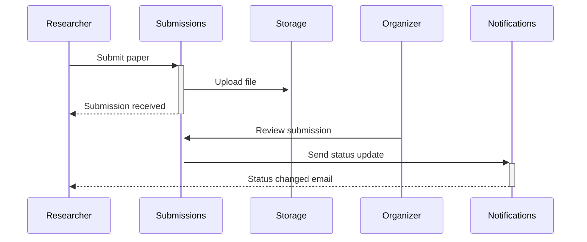

### Payment Verification Flow

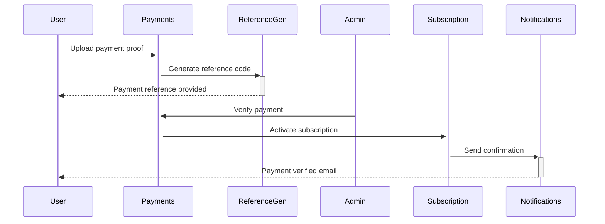

## Feature Organization

### Component Architecture

- **Page Components**: Main route entry points
- **Feature Components**: Specialized for specific functionality
- **Common Components**: Reusable UI elements
- **Layout Components**: Page structure and navigation

### Data Access Patterns

- **Server Components**: Direct database access via Supabase server-side SDK
- **Client Components**: Access via authenticated API routes
- **API Routes**: Middleware validation and error handling
- **Database Views**: Pre-composed queries for common data access
- **RLS Policies**: Fine-grained access control at the database level

### State Management

- **Server State**: Primarily handled through database
- **Client State**: Local React state for UI concerns
- **Shared State**: React Context for cross-component coordination
- **Realtime Updates**: Supabase Realtime for live data synchronization

## System Boundaries

### User Types and Permissions

- **Researcher Capabilities**:
  - Browse and search events
  - Submit papers to events (paid tier)
  - Track submission status
  - Download accepted papers (paid tier)

- **Organizer Capabilities**:
  - Create and manage events
  - Review submissions
  - Update submission status
  - Communicate with submitters

- **Admin Capabilities**:
  - Verify users
  - Process payments
  - Manage system settings
  - Access analytics and reporting

### Integration Points

- **Email Delivery**: Integrated email service
- **File Storage**: Supabase Storage
- **Search System**: PostgreSQL full-text search
- **Payment Processing**: Manual verification (initial), payment gateway integration (future)

## Error Handling

- **Validation Errors**: Client and server-side validation with Zod
- **Authentication Errors**: Redirect to login with error messages
- **Authorization Errors**: Clear permission denied messages
- **System Errors**: Graceful degradation with appropriate status codes
- **Database Constraints**: Proper error handling for uniqueness and referential integrity

## Monitoring and Analytics

- **User Analytics**: Tracking user engagement and behavior
- **Performance Monitoring**: Page load times and API response times
- **Error Tracking**: Centralized error collection and reporting
- **Audit Logging**: Tracking critical operations for security and debugging